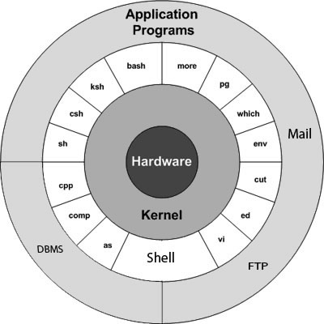
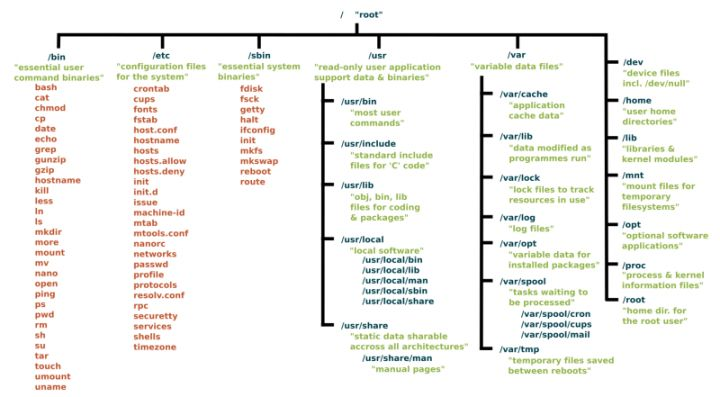

<font size=6 face="Times New Roman">Linux Notes</font>

***

[TOC]

***

## 说明

本文内容非原创，待完善

***

## 1.简介

* Linux 版本
  内核版本指的是在 Linus 领导下的开发小组开发出的系统内核的版本号。Linux 的每个内核版本使用形式为 x.y.zz-www 的一组数字来表示。其中：
  * x.y：为linux的主版本号。通常y若为奇数，表示此版本为测试版，系统会有较多bug，主要用途是提供给用户测试。
  * zz：为次版本号。
  * www：代表发行号（注意，它与发行版本号无关）。

* Linux 体系结构图
  
  
   * 内核：内核是操作系统的核心。内核直接与硬件交互，并处理大部分较低层的任务，如内存管理、进程调度、文件管理等。
   * Shell：Shell是一个处理用户请求的工具，它负责解释用户输入的命令，调用用户希望使用的程序。
   * 命令和工具：日常工作中，你会用到很多系统命令和工具，如cp、mv、cat和grep等。在Linux系统中，有250多个命令，每个命令都有多个选项；第三方工具也有很多，他们也扮演着重要角色。
   * 文件和目录：Linux系统中所有的数据都被存储到文件中，这些文件被分配到各个目录，构成文件系统。Linux的目录与Windows的文件夹是类似的概念。

* 登陆Linux
  
* 修改密码
  ```
  $ passwd
  ```
* 查看目录和文件
  ```
  $ ls -l
  ```
* 查看当前用户
  ```
  $ whoami
  ```
* 查看当前在线用户
  ```
  $ who
  ``
* 退出登陆

* 关闭系统
  |命令|说明|
  |:-:|:-:|
  |halt|直接关闭系统|
  |init 0 | 使用预定义脚本关闭系统，关闭前可以清理和更新有关信息|
  |init 6|重启|
  |poweroff|断电关闭系统|
  |reboot|重启|
  |shutdown|关机|

  一般情况下使用超级用户和root用户才有关闭系统权限。

***

## 2.文件管理

* 在Linux中，有三种基本的文件类型
  1. 普通文件
    普通文件是以字节为单位的数据流，包括文本文件、源码文件、可执行文件等。文本和二进制对Linux来说并无区别，对普通文件的解释由处理该文件的应用程序进行。
  2. 目录
    目录可以包含普通文件和特殊文件，目录相当于Windows和Mac OS中的文件夹。
  3. 设备文件
    有些教程中称特殊文件，是一个含义。Linux 与外部设备（例如光驱，打印机，终端，modern等）是通过一种被称为设备文件的文件来进行通信。Linux 输入输出到外部设备的方式和输入输出到一个文件的方式是相同的。Linux 和一个外部设备通讯之前，这个设备必须首先要有一个设备文件存在。

* 查看文件
  ```
  $ ls -l

  drwxrwxr-x  2 amrood amrood      4096 Dec 25 09:59 uml
  -rw-rw-r--  1 amrood amrood      5341 Dec 25 08:38 uml.jpg
  drwxr-xr-x  2 amrood amrood      4096 Feb 15  2006 univ
  drwxr-xr-x  2 root   root        4096 Dec  9  2007 urlspedia
  -rw-r--r--  1 root   root      276480 Dec  9  2007 urlspedia.tar
  drwxr-xr-x  8 root   root        4096 Nov 25  2007 usr
  drwxr-xr-x  2    200    300      4096 Nov 25  2007 webthumb-1.01
  -rwxr-xr-x  1 root   root        3192 Nov 25  2007 webthumb.php
  -rw-rw-r--  1 amrood amrood     20480 Nov 25  2007 webthumb.tar
  -rw-rw-r--  1 amrood amrood      5654 Aug  9  2007 yourfile.mid
  -rw-rw-r--  1 amrood amrood    166255 Aug  9  2007 yourfile.swf
  drwxr-xr-x 11 amrood amrood      4096 May 29  2007 zlib-1.2.3
  $
  ```
  每一列的含义如下：
  * 第一列：文件类型。
  * 第二列：表示文件个数。如果是文件，那么就是1；如果是目录，那么就是该目录中文件的数目。
  * 第三列：文件的所有者，即文件的创建者。
  * 第四列：文件所有者所在的用户组。在Linux中，每个用户都隶属于一个用户组。
  * 第五列：文件大小（以字节计）。
  * 第六列：文件被创建或上次被修改的时间。
  * 第七列：文件名或目录名。

* 元字符
  元字符是具有特殊含义的字符。* 和 ? 都是元字符：
    * 可以匹配 0 个或多个任意字符；
    * ? 匹配一个字符。
   eg：`$ ls *.doc`：显示所有的doc结尾文件

* 隐藏文件
  隐藏文件的第一个字符为英文句号或点号(.)，Linux程序（包括Shell）通常使用隐藏文件来保存配置信息。
  下面是一些常见的隐藏文件：
  + .profile：Bourne shell (sh) 初始化脚本
  + .kshrc：Korn shell (ksh) 初始化脚本
  + .cshrc：C shell (csh) 初始化脚本
  + .rhosts：Remote shell (rsh) 配置文件

  查看隐藏文件需要 使用**ls**命令的<b>-a</b>选项
  ```
  $ ls -a
  ```
* 创建文件
  ```
  $ vi <filename>
  ```

* 编辑文件
  普通模式下，使用：
  + l 键右移
  + h 键左移
  + k 键上移
  + j 键下移

* 查看文件内容
  ```
  $ cat [-b] <filename>
  ``` 
  <b>-b</b>显示行号

* 统计单词数目
  ```
  $ wc <filename>
  2 16 199 filename
  ```
  每一列的含义如下：
  + 第一列：文件的总行数
  + 第二列：单词数目
  + 第三列：文件的字节数，即文件的大小
  + 第四列：文件名

* 复制文件
  ```
  $ cp <src_file> <dst_file>
  ```

* 重命名
  ```
  $ mv <old_file_name> <new_file_name>
  ```

* 删除文件
  ```
  $ rm <filename>
  ```

* 标准的Linux流
  一般情况下，每个Linux程序运行时都会创建三个文件流（三个文件）：
  + 标准输入流(stdin)：stdin的文件描述符为0，Linux程序默认从stdin读取数据。
  + 标准输出流(stdout)：stdout 的文件描述符为1，Linux程序默认向stdout输出数据。
  + 标准错误流(stderr)：stderr的文件描述符为2，Linux程序会向stderr流中写入错误信息。

***

## 3.Linux目录

* 主目录
  `$ cd ~`进入主目录，`$ cd ~username`进入其他用户主目录。
  `$ cd -`返回进入当前目录前的目录

* 绝对路径 和 相对路径
  `/`代表根目录，以`/`开头的都是绝对路径，否则为相对路径，相对路径表示与当前目录关系。

* 创建目录
  `$ mkdir [-p] <dirname>`,`-p`选项可以防止上级目录不存在时，一层层创建。

* 删除目录
  `$ rmdir <dirname>`

* 重命名目录
  `$ mv <olddir> <newdir>`

* 点号
  一个点号`(.)`代表当前目录，两个`(..)`代表上级目录。

***

## 4.Linux文件权限和访问模式

* 为了更加安全的存储文件，Linux为不同的文件赋予了不同的权限，每个文件都拥有下面三类对象定义权限：
  + 所有者权限(o=owner)：文件所有者能够进行的操作
  + 组权限(g=group)：文件所属用户组能够进行的操作
  + 外部权限（其他权限）(o=other)：其他用户可以进行的操作。

* 主要权限
  |权限|针对文件|针对文件夹|
  |-|-|-|
  |r (Read)|读取文件内容|查看目录下文件列表|
  |w (Write)|修改文件内容|删除和创建目录下的文件|
  |x (eXecute)|用户可以将文件作为程序来运行;执行权限对除二进制文件外无意义|可以cd进入目录，能查看目录中文件的详细属性，能访问目录下文件内容（基础权限）|

* 查看文件权限
  `$ ls -l <dirname>`的第一列包含文件或目录的权限。
  第一列共10位：
  |9|8|7|6|5|4|3|2|1|0|
  |-|-|-|-|-|-|-|-|-|-|
  |\-|r|w|x|r|-|x|r|-|x|
  + 第9位表示文件类型
    p：命名管道文件
    d：目录文件
    l：符号连接文件
    -：普通文件
    s：socket文件
    c：字符设备文件
    b：块设备文件

* 改变权限
  可以使用**chmod**(change mode)命令来改变文件或目录的访问权限，权限可以使用数字或符号表示
  + 使用符号表示权限
    |符号|说明|
    |:-:|:-:|
    |+|增加权限|
    |-|删除权限|
    |=|指定权限|
    
    例子：
    ```
    $ chmod u+x <filename>
    $ chmod o-wx <filename>
    $ chmod g=rx <filename>
    $ chmod o+wx,u-x,g=rx <filename>
    ```
  + 使用数字表示权限
    |数字|说明|权限|
    |-|-|-|
    |0|没有权限|---|
    |1|执行权限|--x|
    |2|写入权限|-w-|
    |3|执行+写入：1+3=4|-wx|
    |4|读取权限|r--|
    |5|读取+执行：4+1=5|r-x|
    |6|读取+写入：4+2=6|rw-|
    |7|所有权限：4+2+1=7|rwx|

    例子：
    ```
    $ chmod 743 <filename>
    ```

* 更改所有者和用户
  在Linux中，每添加一个新用户，就会为它分配一个用户ID和群组ID，上面提到的文件权限也是基于用户和群组来分配的。

  有两个命令可以改变文件的所有者或群组：
  + chown：chown 命令是"change owner"的缩写，用来改变文件的所有者。
  + chgrp：chgrp 命令是"change group"的缩写，用来改变文件所在的群组。
  
  ```
  $ chown <username/userid> <filename>
  $ chgrp <groupname/groupid> <filename>
  ```

* SUID SGID位
  + 在`Linux`中，一些程序需要特殊权限才能完成用户指定的操作。
  例如，用户的密码保存在 `/etc/shadow` 文件中，出于安全考虑，一般用户没有读取和写入的权限。但是当我们使用 `passwd` 命令来更改密码时，需要对 `/etc/shadow` 文件有写入权限。这就意味着，passwd 程序必须要给我们一些特殊权限，才可以向`/etc/shadow` 文件写入内容。
  + `Linux`通过给程序设置`SUID(Set User ID)`和`SGID(Set Group ID)`位来赋予普通用户特殊权限。当我们运行一个带有`SUID`位的程序时，就会继承该程序所有者的权限；如果程序不带`SUID`位，则会根据程序使用者的权限来运行。`SGID`也是一样。一般情况下程序会根据你的组权限来运行，但是给程序设置SGID后，就会根据程序所在组的组权限运行。
  + 如果程序设置了`SUID`位，就会在表示文件所有者可执行权限的位置上出现`s`字母；同样，如果设置了`SGID`，就会在表示文件群组可执行权限的位置上出现`s`字母。如下所示： 
  ```
  $ ls -l /usr/bin/passwd
  -r-sr-xr-x  1   root   bin  19031 Feb 7 13:47  /usr/bin/passwd*
  $
  ```
  + 上面第一列第四个字符不是'x'或'-'，而是's'，说明 /usr/bin/passwd 文件设置了SUID位，这时普通用户会以root用户的权限来执行passwd程序。
  注意：小写字母's'说明文件所有者有执行权限(x)，大写字母'S'说明程序所有者没有执行权限(x)。
  + 如果在表示群组权限的位置上出现SGID位，那么也仅有三类用户可以删除该目录下的文件：目录所有者、文件所有者、超级用户 root。
  + 为一个目录设置SUID和SGID位可以使用下面的命令： 
  ```
  $ chmod ug+s dirname
  $ ls -l
  drwsr-sr-x 2 root root  4096 Jun 19 06:45 dirname
  $
  ```

***

## 5.Linux环境变量

* 环境变量
  环境变量是一个很重要的概念。环境变量可以由系统、用户、**Shell**以及其他程序来设定。变量就是一个可以被赋值的字符串，赋值范围包括数字、文本、文件名、设备以及其他类型的数据。下面的例子，我们将为变量 TEST 赋值，然后使用 echo 命令输出： 
  ```
  $TEST="Linux Programming"
  $echo $TEST
  Linux Programming
  ```
  **注意**：变量赋值时前面不能加 `$` 符号，变量输出时必须要加 `$` 前缀。退出**Shell**时，变量将消失。

* 系统初始化
  登录系统后，**Shell**会有一个初始化的过程，用来设置环境变量。这个阶段，**Shell**会读取 `/etc/profile` 和 `.profile` 两个文件，过程如下：
    1. Shell首先检查`/etc/profile`文件是否存在，如果存在，就读取内容，否则就跳过，但是不会报错。
    2. 然后检查你的主目录（登录目录）中是否存在`.profile` 文件，如果存在，就读取内容，否则就跳过，也不会报错。
  读取完上面两个文件，Shell就会出现 $ 命令提示符： 
  ```
  $
  ```
 出现这个提示符，就可以输入命令并调用相应的程序了。
 **注意**：上面是Bourne Shell的初始化过程，bash 和 ksh 在初始化过程中还会检查其他文件。

* .profile文件
  `/etc/profile`文件包含了通用的Shell初始化信息，由Linux管理员维护，一般用户无权修改。
  但是可以修改主目录下的`.profile`文件，增加一些“私人定制”初始化信息，包括：
  + 设置默认终端类型和外观样式；
  + 设置**Shell**令查找路径，即PATH变量；
  + 设置命令提示符。

* 设置终端类型
  
* 设置PATH变量
  在命令提示符下输入一个命令时，Shell 会根据`PATH`变量来查找该命令对应的程序，`PATH`变量指明了这些程序所在的路径。一般情况下`PATH`变量的设置如下：
  ```
  $PATH=/bin:/usr/bin
  $
  ```
  多个路径使用冒号(:)分隔。如果用户输入的命令在PATH设置的路径下没有找到，就会报错，例如：
  ```
  $hello
  hello: not found
  $
  ```

* PS1 和 PS2 变量
  PS1变量用来保存命令提示符，可以随意修改，如果你不习惯使用 `$` 作为提示符，也可以改成其他字符。**PS1**变量被修改后，提示符会立即改变。
  例如，把命令提示符设置成`=>`：
  ```
  $PS1='=>'
  =>
  =>
  =>
  ```  
  也可以将提示信息设置成当前目录，例如：
  ```
  =>PS1="[\u@\h \w]\$"
  [root@ip-72-167-112-17 /var/www/tutorialspoint/Linux]$
  [root@ip-72-167-112-17 /var/www/tutorialspoint/Linux]$
  ```
  命令提示信息包含了用户名、主机名和当前目录。
  下表中的转义字符可以被用作PS1的参数，丰富命令提示符信息。
  |转义字符|描述|
  |:-:|-|
  | \t | 当前时间，格式为 HH:MM:SS |
  | \d |	当前日期，格式为Weekday Month Date |
  | \n |	换行 |
  | \W |	当前所在目录 |
  | \w |	当前所在目录的完整路径 |
  | \u |	用户名 |
  | \h |	主机名（IP地址）|
  | #  |	输入的命令的个数，每输入一个新的命令就会加1 |
  | \$ |	如果是超级用户 root，提示符为#，否则为$。|
 
  可以在每次登录的时候修改提示符，也可以在 .profile 文件中增加 PS1 变量，这样每次登录时会自动修改提示符。

  如果用户输入的命令不完整，**Shell**还会使用第二提示符来等待用户完成命令的输入。默认的第二命令提示符是 >，保存在**PS2**变量，可以随意修改。

  下面的例子使用默认的第二命令提示符：
  ```
  $ echo "this is a
  > test"
  this is a
  test
  $
  ```
  下面的例子通过PS2变量改变提示符：
  ```
  $ PS2="secondary prompt->"
  $ echo "this is a
  secondary prompt->test"
  this is a
  test
  $
  ```

* 常用环境变量
  | 变量 |	描述 |
  |-|-|
  | DISPLAY |	用来设置将图形显示到何处。|
  | HOME |	当前用户的主目录。|
  | IFS |	内部域分隔符。|
  | LANG |	LANG可以让系统支持多语言。例如，将LANG设为pt_BR，则可以支持(巴西)葡萄牙语。|
  | PATH |	指定Shell命令的路径。|
  | PWD |	当前所在目录，即 cd 到的目录。|
  | RANDOM |	生成一个介于 0 和 32767 之间的随机数。|
  | TERM |	设置终端类型。|
  | TZ |	时区。可以是AST(大西洋标准时间)或GMT(格林尼治标准时间)等。|
  | UID |	以数字形式表示的当前用户ID，shell启动时会被初始化。|

***

## 6.Linux打印文件和发送邮件

* pr命令
  ```
  $ pr [-k] [-d] [-h] [-t] [-l] [-o] [w] <filename>
  ```
  -k：打印分成几列，默认1；
  -d：两倍行距
  -h：设置每页标题
  -t：不打印标题和上下边距
  -l：每页显示多少行，默认66 文本占56
  -o：每行缩进空格数
  -w：多列输出，设置页面宽度，默认72字符

* 发送邮件
  ```
  $ mail [-s 邮件标题] [-c 要发送的用户，多个用户用逗号隔开] [-b 需要密送用户，多给你过户逗号隔开] <邮件接收地址>
  ```

***

## 7.Linux管道和过滤器

* 管道
  * 一个命令的输出作为另一个命令的输入，这就叫做**管道**。为了建立管道，需要在两个命令之间使用竖线(|)连接。
  * 管道是Linux进程之间一种重要的通信机制；除了管道，还有共享内存、消息队列、信号、套接字(socket) 等进程通信机制。
  * 管道使用竖线(|)将两个命令隔开，竖线左边命令的输出就会作为竖线右边命令的输入。连续使用竖线表示第一个命令的输出会作为第二个命令的输入，第二个命令的输出又会作为第三个命令的输入，依此类推。

* 过滤器
  能够接受数据，过滤（处理或筛选）后再输出的工具，称为**过滤器**。

* grep命令
  `grep`源于 ed（Linux的一个行文本编辑器）的`g/re/p`命令，`g/re/p`是“globally search for a regular expression and print all lines containing it”的缩写，意思是使用正则表达式进行全局检索，并把匹配的行打印出来。
  ```
  $ grep <pattern> <files>
  ```
  `grep` 可以看做是一个过滤器，如果没有为 `grep` 指定要检索的文件，那么它会从标准输入设备（一般是键盘）读取；其他过滤器也是如此。
  `grep`命令的选项：
  |选项 | 说明 |
  |-|-|
  |-v |	反转查询，输出不匹配的行。例如，`grep -v "test" demo.txt` 将输出不包含"test"的行。 |
  |-n |	输出匹配的行以及行号。 |
  |-l |	输出匹配的行所在的文件名。 |
  |-c |	输出匹配的总行数。 |
  |-i |	不区分大小写进行匹配。 |

* sort命令
  `sort` 命令在 Linux 中非常有用，它将文件中的各行按字母或数进行排序。`sort`命令既可以从特定的文件，也可以从stdin获取输入。
  `sort`选项:
  |选项 |	描述 |
  |-n |	按照数字大小排序，例如，10会排在2后面；-n 选项会忽略空格或 tab缩进。 |
  |-r |	降序排序。sort 默认是升序排序。 |
  |-f |	不区分大小写。|
  |+x |	对第x列（从0开始）进行排序。|

* pg 和 more 命令
  如果文件内容过多，全部显示会很乱，可以使用 pg 和 more 命令分页显示，每次只显示一屏。

  如上，一次只显示一屏文本，显示满后，停下来，并提示已显示全部内容的百分比，按空格键(space)可以查看下一屏，按 b 键可以查看上一屏。

***

## 8.Linux进程管理

当我们运行程序时，Linux会为程序创建一个特殊的环境，该环境包含程序运行需要的所有资源，以保证程序能够独立运行，不受其他程序的干扰。这个特殊的环境就称为进程。每个 Linux 命令都与系统中的程序对应，输入命令，Linux 就会创建一个新的进程。

系统通过一个五位数字跟踪程序的运行状态，这个数字称为 pid 或进程ID。每个进程都拥有唯一的 pid。

* 创建进程
  有两种方式来创建进程：前台进程和后台进程。

* 前台进程
  默认情况下，用户创建的进程都是前台进程；前台进程从键盘读取数据，并把处理结果输出到显示器。

* 后台进程
  后台进程与键盘没有必然的关系。当然，后台进程也可能会等待键盘输入。后台进程的优点是不必等待程序运行结束就可以输入其他命令。
  **创建后台进程最简单的方式就是在命令的末尾加 &**

* 查看正在运行的进程
  ```
  $ ps [-f] [-a] [-x] [-u] [-e]
  UID   PID   PPID    C   STIME   TTY   TIME    CMD
  ```
  |选项|说明|
  |-|-|
  |-f|显示全部信息|
  |-a|显示所有用户的所有进程。|
  |-x|显示无终端的进程。|
  |-u|显示更多信息，类似于 -f 选项。|
  |-e|显示所有进程。|

  |列|描述|
  |-|-|
  |UID|用户id|
  |PID|进程id|
  |PPID|父进程id|
  |C|CPU使用率|
  |STIME|进程被创建时间|
  |TTY|与进程有关的终端类型|
  |TIME|进程使用的CPU时间|
  |CMD|创建该进程的命令|

* 终止进程
  ```
  $ kill [-9] PID
  ```

* 父进程 和 子进程
  每个 Linux 进程会包含两个进程ID：当前进程ID(pid)和父进程ID(ppid)。
  由用户运行的大部分命令都将 Shell 作为父进程。

* 僵尸进程 孤儿进程
  正常情况下，子进程被终止时会通过 SIGCHLD 信号通知父进程，父进程可以做一些清理工作或者重新启动一个新的进程。但在某些情况下，父进程会在子进程之前被终止，那么这些子进程就没有了“父亲”，被称为**孤儿进程**。

  init 进程会成为所有孤儿进程的父进程。init 的 pid 为1，是Linux系统的第一个进程，也是所有进程的父进程。

  如果一个进程被终止了，但是使用 ps 命令仍然可以查看该进程，并且状态为 Z，那么这就是一个**僵尸进程**。僵尸进程虽然被终止了，但是仍然存在于进程列表中。一般僵尸进程很难杀掉，你可以先杀死他们的父进程，让他们变成孤儿进程，init 进程会自动清理僵尸进程。

* 常驻进程
  常驻进程一般是系统级进程，以 root 权限运行在后台，可以处理其他进程的请求。

  常驻进程没有终端，不能访问 /dev/tty 文件，如果使用 ps -ef 查看该进程，tty 这一列会显示问号(?)。

  更确切地说，常驻进程通常运行在后台，等待指定事件发生，例如打印进程是一个常驻进程，它会等待用户输入打印相关的命令并进行处理。

* top命令
  top 命令可以显示进程的很多信息，包括物理内存、虚拟内存、CPU使用率、平均负载以及繁忙的进程等。

* 任务和进程
  
  `jobs` 命令可以用来查看系统中正在运行的任务，包括后台运行的任务。该命令可以显示任务号及其对应的进程ID。一个任务可以对应于一个或者多个进程号。

  `jobs` 命令的 `-l` 选项可以查看当前任务包含的进程ID：
  ```
  $jobs -l
  [1] + 1903 running                 ls ch*.doc &
  $
  ```
  其中，第一列表示任务号，第二列表示任务对应的进程ID，第三列表示任务的运行状态，第四列表示启动任务的命令。

* 前台任务和后台任务的切换
  `fg` 命令可以将后台任务调到前台，语法为：
  ```
  $fg %jobnumber
  ```
  jobnumber 是通过 `jobs` 命令获取的后台任务的的序号，注意不是pid。如果后台只有一个任务，可以不指定 jobnumber。

  `bg` 命令可以将后台暂停的任务，调到前台继续运行，语法为：
  ```
  $bg %jobnumber
  ```
  jobnumber 同样是通过 `jobs` 命令获取的后台任务的的序号，注意不是pid。如果前台只有一个任务，可以不指定 jobnumber。

  如果希望将当前任务转移到后台，可以先 `Ctrl+z` 暂停任务，再使用 `bg` 命令。任务转移到后台可以空出终端，继续输入其他命令。

***

## 9.Linux网络通信工具

* Ping命令
  ```
  $ ping hostname or ip-address
  ```

* ftp命令
  `ftp` 是 `File Transfer Protocol` 的缩写，称为文件传输协议。通过 `ftp` 工具，能够将文件上传到远程服务器，也可以从远程服务器下载文件。

  `ftp` 工具有自己的命令（类似Linux命令），可以：

      连接并登录远程主机；
      查看目录，遍历目录下的文件；
      上传或下载文件，包括文本文件、二进制文件等。


  ftp 命令的用法如下：
  ```
  $ftp hostname or ip-address
  ```
  接下来会提示你输入用户名和密码，验证成功后会进入主目录，然后就可以使用 ftp 工具的命令进行操作了。
  |ftp命令|说明|
  |-|-|
  |put filename|将本地文件上传到远程主机。|
  |get filename|将远程文件下载到本地。|
  |mput file list|将多个本地文件上传到远程主机。|
  |mget file list|将多个远程文件下载到本地。|
  |prompt off|关闭提示。默认情况下，使用 mput 或 mget 命令会不断提示你确认文件的上传或下载。|
  |prompt on|打开提示。|
  |dir|列出远程主机当前目录下的所有文件。|
  |cd dirname|改变远程主机目录。|
  |lcd dirname|改变本地目录。|
  |quit|退出登录。|

* telnet

* finger

***

## 10.vi

* 进入vi编辑器
  ```
  $ vi [-R] <filename> 打开文件，无则创建，-R表示只读
  $ view <filename> 只读打开现有文件
  ```

 * 工作模式
  1. 普通模式
  由Shell进入vi编辑器时，首先进入普通模式。在普通模式下，从键盘输入任何字符都被当作命令来解释。普通模式下没有任何提示符，输入命令后立即执行，不需要回车，而且输入的字符不会在屏幕上显示出来。
  普通模式下可以执行命令、保存文件、移动光标、粘贴复制等。
  2. 编辑模式
  编辑模式主要用于文本的编辑。该模式下用户输入的任何字符都被作为文件的内容保存起来，并在屏幕上显示出来。
  3. 命令模式
  命令模式下，用户可以对文件进行一些高级处理。尽管普通模式下的命令可以完成很多功能，但要执行一些如字符串查找、替换、显示行号等操作还是必须要进入命令模式。

  工作模式切换：
  1. 在普通模式下输入 i(插入)、c(修改)、o(另起一行) 命令时进入编辑模式；按 esc 键退回到普通模式。
  2. 在普通模式下输入冒号(:)可以进入命令模式。输入完命令按回车，命令执行完后会自动退回普通模式。
  3. 如果不确定当前处于哪种模式，按两次 Esc 键将回到普通模式。

* 推出vi编辑器
  一般在命令模式下退出 vi 编辑器。
  |退出命令 |	说明 |
  |-|-
  |q |	如果文件未被修改，会直接退回到Shell；否则提示保存文件。 |
  |q! |	强行退出，不保存修改内容。 |
  |wq |	w 命令保存文件，q 命令退出 vi，合起来就是保存并退出。 |
  |ZZ |	保存并退出，相当于 wq，但是更加方便。 |

  退出之前，你也可以在 w 命令后面指定一个文件名，将文件另存为新文件，例如：
  `w filename2`
  将当前文件另存为 filename2。
  **注意**：vi 编辑文件时，用户的操作都是基于缓冲区中的副本进行的。如果退出时没有保存到磁盘，则缓冲区中的内容就会被丢失。

* 移动光标
  为了不影响文件内容，必须在普通模式（按两次 Esc 键）下移动光标。使用下表中的命令每次可以移动一个字符：
  |命令 |	描述|
  |-|-|
  |k |	向上移动光标（移动一行）|
  |j |	向下移动光标（移动一行）|
  |h |	向左移动光标（移动一个字符）|
  |l |	向右移动光标（移动一个字符）|

  * vi 是区分大小写的，输入命令时注意不要锁定大写。
  * 可以在命令前边添加一个数字作为前缀，例如，2j 将光标向下移动两行。

* 控制命令
  |命令 |	描述|
  |-|-|
  |CTRL+d |	向前滚动半屏|
  |CTRL+f |	向前滚动全屏|
  |CTRL+u |	向后滚动半屏|
  |CTRL+b |	向后滚动整屏|
  |CTRL+e |	向上滚动一行|
  |CTRL+y |	向下滚动一行|
  |CTRL+I |	刷新屏幕|

* 编辑文件

* 删除字符

* 修改文本

* 复制粘贴

* 文本查找

  如果希望进行全文件搜索，可以在普通模式（按两次 Esc 键）下输入 `/` 命令，这时状态栏（最后一行）出现 `/` 并提示输入要查找的字符串，回车即可。

  `/` 命令是向下查找，如果希望向上查找，可以使用 `?` 命令。

  这时，输入 `n` 命令可以按相同的方向继续查找，输入 `N` 命令可以按相反的方向继续查找。

  搜索的字符串中可以包含一些有特殊含义的字符，如果希望搜索这些字符本身，需要在前面加反斜杠`\`。

  部分特殊字符列表 
  |字符 |	说明|
  |-|-|
  |^ |	匹配一行的开头|
  |. |	匹配一个字符|
  |* |	匹配0个或多个字符|
  |$ |  匹配一行的结尾|
  |[ ]| 匹配一组字符|

  如果希望搜索某行中的单个字符，可以使用 `f` 或 `F` 命令，`f` 向上搜索，`F` 向下搜索，并且会把光标定位到匹配的字符。

  也可以使用 `t` 或 `T` 命令：`t` 命令向上搜索，并把光标定位到匹配字符的前面；`T` 命令向下搜索，并把光标定位到匹配字符的后面。 

* set命令

* 运行命令

* 文本替换

  切换到命令模式，再输入 s/ 命令即可对文本进行替换。语法为：
  ```
  :s/search/replace/g
  ```
  search 为检索的文本，replace 为要替换的文本，g 表示全局替换。

***

## 11.Linux文件系统

* 分区与目录
  文件系统位于磁盘分区中；一个硬盘可以有多个分区，也可以只有一个分区；一个分区只能包含一个文件系统。

  Linux文件系统与Windows有较大的差别。Windows的文件结构是多个并列的树状结构，最顶部的是不同的磁盘（分区），如 C、D、E、F等。

  Linux的文件结构是单个的树状结构，根目录是“/”，其他目录都要位于根目录下。

  每次安装系统的时候我们都会进行分区，Linux下磁盘分区和目录的关系如下：

    1. 任何一个分区都必须对应到某个目录上，才能进行读写操作，称为“挂载”。
    2. 被挂载的目录可以是根目录，也可以是其他二级、三级目录，任何目录都可以是挂载点。
    3. 目录是逻辑上的区分。分区是物理上的区分。
    4. 根目录是所有Linux的文件和目录所在的地方，需要挂载上一个磁盘分区。

  为什么要分区，如何分区？

    1. 可以把不同资料，分别放入不同分区中管理，降低风险。
    2. 大硬盘搜索范围大，效率低。
    3. `/home`、`/var`、`/usr/local` 经常是单独分区，因为经常会操作，容易产生碎片。

    Linux常见目录及其作用：
    |目录 |	说明|
    |-|-|
    |`/` |	**根目录，只能包含目录，不能包含具体文件。**|
    | `/bin`  | **存放可执行文件**。很多命令就对应`/bin`目录下的某个程序，例如 ls、cp、mkdir。`/bin`目录对所有用户有效。  |
    | `/dev`  | **目录包含设备文件**。其中许多是在启动时或甚至在运行时生成的。硬件驱动程序。例如声卡、磁盘驱动等，还有如 `/dev/null`、`/dev/console`、`/dev/zero`、`/dev/full` 等文件。 |
    | `/etc ` | etcetera的简写，主要包含系统配置文件和用户、用户组配置文件。  |
    | `/lib`  | 主要包含共享库文件，类似于Windows下的DLL；有时也会包含内核相关文件。  |
    | `/boot` | 目录包含**启动系统所需的文件**，例如Linux内核、引导程序等。 |
    | `/home` | 用户工作目录（主目录），每个用户都会分配一个目录。  |
    | `/media`  | 在`/media`目录中，当你插入外部存储器试图访问它时，将自动挂载它。  |
    | `/mnt`  | 临时挂载文件系统。这个目录一般是用于存放挂载储存设备的挂载目录的，例如挂载CD-ROM的cdrom目录。 |
    | `/proc` | 操作系统运行时，进程（正在运行中的程序）信息及内核信息（比如cpu、硬盘分区、内存信息等）存放在这里。`/proc`目录伪装的文件系统proc的挂载目录，proc并不是真正的文件系统。  |
    | `/sys`  | `/sys` 是另一个类似 `/proc` 和 `/dev` 的虚拟目录，它还包含连接到计算机的设备的信息。  |
    | `/opt`  | `/opt `目录通常是你编译软件（即，你从源代码构建，并不是从你的系统的软件库中安装软件）的地方。应用程序最终会出现在 `/opt/bin` 目录，库会在 `/opt/lib` 目录中出现。 |
    | `/tmp`  | 临时文件目录，系统重启后不会被保存。`/tmp` 是少数挂载到根目录下而你可以在不成为超级用户的情况下与它进行实际交互的目录之一。  |
    | `/usr`  | /user目下的文件比较混杂，包含了管理命令、共享文件、库文件等，可以被很多用户使用。 |
    | `/run`  | `/run` 是另一个新出现的目录。系统进程出于自己不可告人的原因使用它来存储临时数据。这是另一个不要动它的文件夹。 |
    | `/var `|  variable的简写，主要包含一些可变长度的文件，会经常对数据进行读写，例如日志文件和打印队列里的文件。  |
    | `/srv`  | `/srv` 目录包含服务器的数据。如果你正在 Linux 机器上运行 Web 服务器，你网站的 HTML文件将放到 `/srv/http`（或 `/srv/www`）。 如果你正在运行 FTP 服务器，则你的文件将放到 `/srv/ftp`。  |
    | `/sbin` | 和 `/bin` 类似，主要包含可执行文件，不过一般是系统管理所需要的，不是所有用户都需要。  |

    

* 常用文件管理命令

  |Command | Description|
  |-|-|
  |`cat filename` |	查看文件内容。|
  |`cd dirname `|	改变所在目录。|
  |`cp file1 file2` |	复制文件或目录。|
  |`file filename` |	查看文件类型(binary, text, etc)。|
  |`find filename dir` |	搜索文件或目录。|
  |`head filename` |	显示文件的开头，与tail命令相对。|
  |`less filename` |	查看文件的全部内容，可以分页显示，比more命令要强大。|
  |`ls dirname` |	遍历目录下的文件或目录。|
  |`mkdir dirname` |	创建目录。|
  |`more filename` |	查看文件的全部内容，可以分页显示。|
  |`mv file1 file2` |	移动文件或重命名。|
  |`pwd` |	显示用户当前所在目录。|
  |`rm filename` |	删除文件。|
  |`rmdir dirname` |	删除目录。|
  |`tail filename` |	显示文件的结尾，与head命令相对。|
  |`touch filename` |	文件不存在时创建一个空文件，存在时修改文件时间戳。|
  |`whereis filename` |	查看文件所在位置。|
  |`which filename` |	如果文件在环境变量PATH中有定义，那么显示文件位置。|

* df命令
  管理磁盘分区时经常会使用 `df` (disk free) 命令，`df -k` 命令可以用来查看磁盘空间的使用情况（以千字节计），例如：
  ```
  $df -k
  Filesystem      1K-blocks      Used   Available Use% Mounted on
  /dev/vzfs        10485760   7836644     2649116  75% /
  /devices                0         0           0   0% /devices
  $
  ```
  每一列的含义如下：
  |列 |	说明|
  |-|-|
  |Filesystem |	代表文件系统对应的设备文件的路径名（一般是硬盘上的分区）。|
  |kbytes |	分区包含的数据块（1024字节）的数目。|
  |used |	已用空间。|
  |avail |	可用空间。|
  |capacity |	已用空间的百分比。|
  |Mounted on |	文件系统挂载点。|

  某些目录（例如 /devices）的 kbytes、used、avail 列为0，use列为0%，这些都是特殊（或虚拟）文件系统，即使位于根目录下，也不占用硬盘空间。

  你可以结合 `-h` (human readable) 选项将输出信息格式化，让人更易阅读。


* du命令

  `du` (disk usage) 命令可以用来查看特定目录的空间使用情况。

  `du` 命令会显示每个目录所占用数据块。根据系统的不同，一个数据块可能是 512 字节或 1024 字节。举例如下：
  ```
  $du /etc
  10     /etc/cron.d
  126    /etc/default
  6      /etc/dfs
  ...
  $
  ```
  结合 -h 选项可以让信息显示的更加清晰

* 挂载文件系统
  挂载是指将一个硬件设备（例如硬盘、U盘、光盘等）对应到一个已存在的目录上。 若要访问设备中的文件，必须将文件挂载到一个已存在的目录上， 然后通过访问这个目录来访问存储设备。

  这样就为用户提供了统一的接口，屏蔽了硬件设备的细节。Linux将所有的硬件设备看做文件，对硬件设备的操作等同于对文件的操作。

  **注意**：挂载目录可以不为空，但挂载后这个目录下以前的内容将不可用。

  需要知道的是，光盘、软盘、其他操作系统使用的文件系统的格式与linux使用的文件系统格式是不一样的，挂载需要确认Linux是否支持所要挂载的文件系统格式。

  查看当前系统所挂载的硬件设备可以使用 mount 命令： `$ mount`
  一般约定，`/mnt` 为临时挂载目录，例如挂载CD-ROM、远程网络设备、软盘等。
  也可以通过mount命令来挂载文件系统，语法为：
  ```
  mount -t file_system_type device_to_mount directory_to_mount_to
  ```
  例如：
  ```
  $ mount -t iso9660 /dev/cdrom /mnt/cdrom
  ```
  将 CD-ROM 挂载到 /mnt/cdrom 目录。

  **注意**：file_system_type用来指定文件系统类型，**通常可以不指定，Linux会自动正确选择文件系统类型**。

  挂载文件系统后，就可以通过 `cd、cat` 等命令来操作对应文件。

  可以通过 `umount` 命令来卸载文件系统。例如，卸载 cdrom：
  ```
  $ umount /dev/cdrom
  ```
  `不过，大部分现代的Linux系统都有自动挂载卸载功能，unmount` 命令较少用到。

* 用户和群组配额
  用户和群组配额可以让管理员为每个用户或群组分配固定的磁盘空间。

  管理员有两种方式来分配磁盘空间：

    + 软限制：如果用户超过指定的空间，会有一个宽限期，等待用户释放空间。
    + 硬限制：没有宽限期，超出指定空间立即禁止操作。

  下面的命令可以用来管理配额：
  |命令 |	说明|
  |-|-|
  |quota |	显示磁盘使用情况以及每个用户组的配额。|
  |edquota |	编辑用户和群组的配额。|
  |quotacheck |	查看文件系统的磁盘使用情况，创建、检查并修复配额文件。|
  |setquota |	设置配额。|
  |quotaon |	开启用户或群组的配额功能。|
  |quotaoff |	关闭用户或群组的配额功能。|
  |repquota |	打印指定文件系统的配额。|

***

## 12.Linux文件存储结构

大部分的Linux文件系统（如ext2、ext3）规定，一个文件由目录项、inode和数据块组成：
  1. 目录项：包括文件名和inode节点号。
  2. Inode：又称文件索引节点，包含文件的基础信息以及数据块的指针。
  3. 数据块：包含文件的具体内容。

* inode
  文件储存在硬盘上，硬盘的最小存储单位叫做"**扇区**"（**Sector**），每个扇区储存512字节（相当于0.5KB）。
  操作系统读取硬盘的时候，不会一个扇区一个扇区地读取，这样效率太低，而是一次性连续读取多个扇区，即一次性读取一个"**块**"（**block**）。这种由多个扇区组成的"块"，是文件存取的最小单位。"块"的大小，最常见的是4KB，即连续八个 sector组成一个 block。
  文件数据都储存在"块"中，那么很显然，我们还必须找到一个地方储存文件的元信息，比如文件的创建者、文件的创建日期、文件的大小等等。这种储存文件元信息的区域就叫做**inode**，中文译名为"索引节点"。

  inode包含文件的元信息，具体来说有以下内容：
  
  + 文件的字节数。
  + 文件拥有者的User ID。
  + 文件的Group ID。
  + 文件的读、写、执行权限。
  + 文件的时间戳，共有三个：ctime指inode上一次变动的时间，mtime指文件内容上一次变动的时间，atime指文件上一次打开的时间。
  + 链接数，即有多少文件名指向这个inode。
  + 文件数据block的位置。
  可以用stat命令，查看某个文件的inode信息:`$ stat <filename>`

* 目录项
  Linux系统中，目录（directory）也是一种文件。打开目录，实际上就是打开目录文件。

  目录文件的结构非常简单，就是一系列目录项（dirent）的列表。每个目录项，由两部分组成：所包含文件的文件名，以及该文件名对应的inode号码。

  ls命令只列出目录文件中的所有文件名： `$ ls /etc`
  ls -i命令列出整个目录文件，即文件名和inode号码：`ls -i /etc`
  如果要查看文件的详细信息，就必须根据inode号码，访问inode节点，读取信息。`ls -l`命令列出文件的详细信息。`ls -l /etc`

* 硬链接 和 软连接

  + 硬链接
    一般情况下，文件名和inode号码是"一一对应"关系，每个inode号码对应一个文件名。但是，Linux系统允许，多个文件名指向同一个inode号码。这意味着，可以用不同的文件名访问同样的内容；对文件内容进行修改，会影响到所有文件名；但是，删除一个文件名，不影响另一个文件名的访问。这种情况就被称为"硬链接"（hard link）。
    ln命令可以创建硬链接，语法为：`ln source_file target_file`
    创建目录时，默认会生成两个目录项："."和".."。前者的inode号码就是当前目录的inode号码，等同于当前目录的"硬链接"；后者的inode号码就是当前目录的父目录的inode号码，等同于父目录的"硬链接"。所以，任何一个目录的"硬链接"总数，总是等于2加上它的子目录总数（含隐藏目录）,这里的2是父目录对其的“硬链接”和当前目录下的".硬链接“。 
  + 软连接
    文件A和文件B的inode号码虽然不一样，但是文件A的内容是文件B的路径。读取文件A时，系统会自动将访问者导向文件B。因此，无论打开哪一个文件，最终读取的都是文件B。这时，文件A就称为文件B的"软链接"（soft link）或者"符号链接（symbolic link）。
    这意味着，文件A依赖于文件B而存在，如果删除了文件B，打开文件A就会报错：`"No such file or directory"`。这是软链接与硬链接最大的不同：文件A指向文件B的文件名，而不是文件B的inode号码，文件B的inode"链接数"不会因此发生变化。
    `ln -s`命令可以创建软链接，语法为：`ln source_file target_file`

***

## 13.Linux用户管理

在Linux中，有三种用户：
  1. Root 用户：也称为超级用户，对系统拥有完全的控制权限。超级用户可以不受限制的运行任何命令。Root 用户可以看做是系统管理员。
  2. 系统用户：系统用户是Linux运行某些程序所必须的用户，例如 mail 用户、sshd 用户等。系统用户通常为系统功能所必须的，不建议修改这些用户。
  3. 普通用户：一般用户都是普通用户，这些用户对系统文件的访问受限，不能执行全部Linux命令。
  
Linux支持用户组，用户组就是具有相同特征的用户的集合。一个组可以包含多个用户，每个用户也可以属于不同的组。用户组在Linux中扮演着重要的角色，方便管理员对用户进行集中管理。

* 与用户和组有关的系统文件
  |系统文件 |	说明|
  |-|-|
  |`/etc/passwd` |	保存用户名和密码等信息，Linux系统中的每个用户都在`/etc/passwd`文件中有一个对应的记录行。这个文件对所有用户都是可读的。|
  |`/etc/shadow` |	`/etc/shadow`中的记录行和`/etc/passwd`中的相对应，他由`pwconv`命令根据`/etc/passwd`中的数据自动产生，它的格式和`/etc/passwd`类似，只是对密码进行了加密。并不是所有的系统都支持这个文件。|
  |`/etc/group` |	以记录行的形式保存了用户组的所有信息。|

  `/etc/passwd`文件中一行记录对应着一个用户，每行记录又被冒号分隔为7个字段，其格式和具体含义如下所示：
  ```
  用户名：密码：用户ID：组ID：描述信息：用户主目录：用户Shell
  ```
  |字段 |	说明|
  |-|-|
  |用户名 |	用户名是惟一的，长度根据不同的linux系统而定，一般是8位。|
  |密码 |	由于系统中还有一个/etc/shadow文件用于存放加密后的口令，所以在这里这一项是“x”来表示，如果用户没有设置口令，则该项为空。如果passwd字段中的第一个字符是“*”的话，那么，就表示该账号被查封了，系统不允许持有该账号的用户登录。|
  |用户ID |	系统内部根据用户ID而不是用户名来识别不同的用户，用户ID有以下几种：0代表系统管理员，如果你想建立一个系统管理员的话，可以建立一个普通帐户，然后将该账户的用户ID改为0即可。1~500系统预留的ID。500以上是普通用户使用。|
  |组ID |	其实这个和用户ID差不多，用来管理群组，与/etc/group文件相关。|
  |描述信息 |	这个字段几乎没有什么用，只是用来解释这个账号的意义。在不同的Linux系统中，这个字段的 格式并没有统一。在许多Linux系统中，这个字段存放的是一段任意的注释性描述文字，用做finger命令的输出。|
  |用户主目录 |	用户登录系统的起始目录。用户登录系统后将首先进入该目录。root用户默认是/，普通用户是/home/username。|
  |用户Shell |	用户登录系统时使用的Shell。|

* 管理用户和组
  |命令 |	说明|
  |-|-|
  |useradd |	添加用户。|
  |usermod |	修改用户信息。|
  |userdel |	删除用户。|
  |groupadd |	添加用户组。|
  |groupmod |	修改用户组信息。|
  |groupdel |	删除用户组。|

* 创建用户组
  添加用户时，可以将用户添加到现有的用户组，或者创建一个新的用户组。可以在 /etc/groups 文件中看到所有的用户组信息。
  默认的用户组通常用来管理系统用户，不建议将普通用户添加到这些用户组。使用groupadd命令创建用户组的语法为：
  ```
  groupadd [-g gid [-o]] [-r] [-f] groupname
  ```
  |选项 |	说明|
  |-|-|
  |-g GID |	以数字表示的用户组ID。|
  |-o |	可以使用重复的组ID。|
  |-r |	建立系统组，用来管理系统用户。|
  |-f |	强制创建。|
  |groupname |	用户组的名称。|

* 修改用户组
  groupmod命令可以用来修改用户组，语法为：
  ```
  $ groupmod -n new_modified_group_name old_group_name
  ```
  例如，将用户组 developers_2 重命名为 developer：
  ```
  $ groupmod -n developer developer_2
  ```
  将developer用户组的ID改为545：
  ```
  $ groupmod -g 545 developer
  ```
* 删除用户组
  通过groupdel命令可以删除用户组。例如，删除developer组：
  ```
  $ groupdel developer
  ```
  groupdel 仅仅删除用户组，并不删除与之相关的文件，这些文件仍然可以被所有者访问。
* 添加用户
  添加用户可以使用useradd命令，语法为：
  ```
  useradd -d homedir -g groupname -m -s shell -u userid accountname
  ```
  |选项 |	描述|
  |-|-|
  |-d homedir |	指定用户主目录。|
  |-g groupname |	指定用户组。|
  |-m |	如果主目录不存在，就创建。|
  |-s shell |	为用户指定默认Shell。|
  |-u userid |	指定用户ID。|
  |accountname |	用户名。|

  如果不指定任何选项，系统将使用默认值。useradd 命令将会修改 `/etc/passwd`、`/etc/shadow`、and `/etc/group` 三个文件，并创建用户主目录。

  下面的例子将会添加用户 mcmohd，并设置主目录为 `/home/mcmohd`，用户组为 developers，默认 Shell 为  `Korn Shell`：
  ```
  $ useradd -d /home/mcmohd -g developers -s /bin/ksh mcmohd
  ```
  **注意**：如果你是管理员，输入 $ passwd username 可以修改你所管理的用户的密码；否则只能修改你自己的密码（不需要提供username）。 

* 修改用户
  usermod 命令可以修改现有用户的信息。usermod 命令的选项和 useradd 相同，不过可以增加 `-l` 选项来更改用户名。

  下面的例子将用户 mcmohd 的用户名修改为 mcmohd20，主目录修改为 `/home/mcmohd20`：
  ```
  $ usermod -d /home/mcmohd20 -m -l mcmohd mcmohd20
  ```

* 删除用户
  userdel 命令可以用来删除现有用户。userdel 是一个危险的命令，请谨慎使用。

  userdel 命令仅有一个选项 `-r`，用来删除用户主目录和本地邮件。例如，删除用户  mcmohd20：
  ```
  $ userdel -r mcmohd20
  ```
  为了便于恢复被误删的用户，可以忽略 `-r` 选项，保留用户主目录，之后确认无误可以随时删除主目录。

***

## 14.Linux系统性能分析

  |因素 |	说明|
  |-|-|
  |用户态CPU |	CPU在用户态运行用户程序所花费的时间，包括库调用，但是不包括内核花费的时间。|
  |内核态CPU |	CPU在内核态运行系统服务所花费的时间。所有的 I/O 操作都需要调用系统服务，程序员可以通过阻塞 I/O 传输来影响这部分的时间。|
  |I/O 时间和网络时间 |	响应 I/O 请求、处理网络连接所花费的时间。|
  |内存 |	切换上下文和交换数据（虚拟内存页导入和导出）花费的时间。|
  |应用程序 |	程序等待运行的时间——CPU正在运行其他程序，等待切换到当前程序。|

  |命令 |	说明|
  |-|-|
  |nice |	启动程序时指定进程优先级。|
  |renice |	调整现有进程的优先级。|
  |netstat |	显示各种网络相关信息，包括网络连接情况、路由表、接口状态(Interface Statistics)、masquerade 连接、多播成员 (Multicast Memberships)等。实际上，netstat 用于显示与IP、TCP、UDP和ICMP协议相关的统计数据，一般用于检验本机各端口的网络连接情况。|
  |time |	检测一个命令运行时间以及资源（CPU、内存、I/O等）使用情况。|
  |uptime |	查看系统负载情况。|
  |ps |	查看系统中进程的资源使用情况（瞬时状态，不是动态监控）。|
  |vmstat |	报告虚拟内存使用情况。|
  |gprof |	精确分析程序的性能，能给出函数调用时间、调用次数、调用关系等。|
  |top |	实时监控系统中各个进程资源的资源使用情况。|

  常用命令组合：
    + vmstat、sar、mpstat检测是否存在CPU瓶颈；
    + vmstat、free检测是否存在内存瓶颈；
    + iostat检测是否存在磁盘I/O瓶颈；
    + netstat检测是否存在网络I/O瓶颈。

***

## 15.Linux系统日志及日志分析

:smile:

***

## 16.Linux信号机制与信号处理

:smile:

***

## 17.yum

* yum 语法
```
yum [options] [command] [package ...]
```
  options：可选，选项包括-h（帮助），-y（当安装过程提示选择全部为 "yes"），-q（不显示安装的过程）等等。
  command：要进行的操作。
  package：安装的包名。
* yum常用命令
  1. 列出所有可更新的软件清单命令：`yum check-update`

  2. 更新所有软件命令：`yum update`

  3. 仅安装指定的软件命令：`yum install <package_name>`

  4. 仅更新指定的软件命令：`yum update <package_name>`

  5. 列出所有可安裝的软件清单命令：`yum list`

  6. 删除软件包命令：`yum remove <package_name>`

  7. 查找软件包命令：`yum search <keyword>`

  8. 清除缓存命令:
        `yum clean packages`: 清除缓存目录下的软件包
        `yum clean headers`: 清除缓存目录下的 headers
        `yum clean oldheaders`: 清除缓存目录下旧的 headers
        `yum clean, yum clean all (= yum clean packages; yum clean oldheaders)` :清除缓存目录下的软件包及旧的 headers

***

## 18.apt

* apt 语法
```
$ apt [options] [command] [package ...]
```
  options：可选，选项包括 -h（帮助），-y（当安装过程提示选择全部为"yes"），-q（不显示安装的过程）等等。
  command：要进行的操作。
  package：安装的包名。

* apt 常用命令
  列出所有可更新的软件清单命令：`sudo apt update`

  升级软件包：`sudo apt upgrade`

  列出可更新的软件包及版本信息：`apt list --upgradeable`

  升级软件包，升级前先删除需要更新软件包：`sudo apt full-upgrade`

  安装指定的软件命令：`sudo apt install <package_name>`

  安装多个软件包：`sudo apt install <package_1> <package_2> <package_3>`

  更新指定的软件命令：`sudo apt update <package_name>`

  显示软件包具体信息,例如：版本号，安装大小，依赖关系等等：`sudo apt show <package_name>`

  删除软件包命令：`sudo apt remove <package_name>`

  清理不再使用的依赖和库文件: `sudo apt autoremove`

  移除软件包及配置文件: `sudo apt purge <package_name>`

  查找软件包命令： `sudo apt search <keyword>`

  列出所有已安装的包：`apt list --installed`

  列出所有已安装的包的版本信息：`apt list --all-versions`


***

参考来源：<http://m.biancheng.net/cpp/linux/>
<p align="right"><b>Author:</b>zwxupc@163.com<p>
